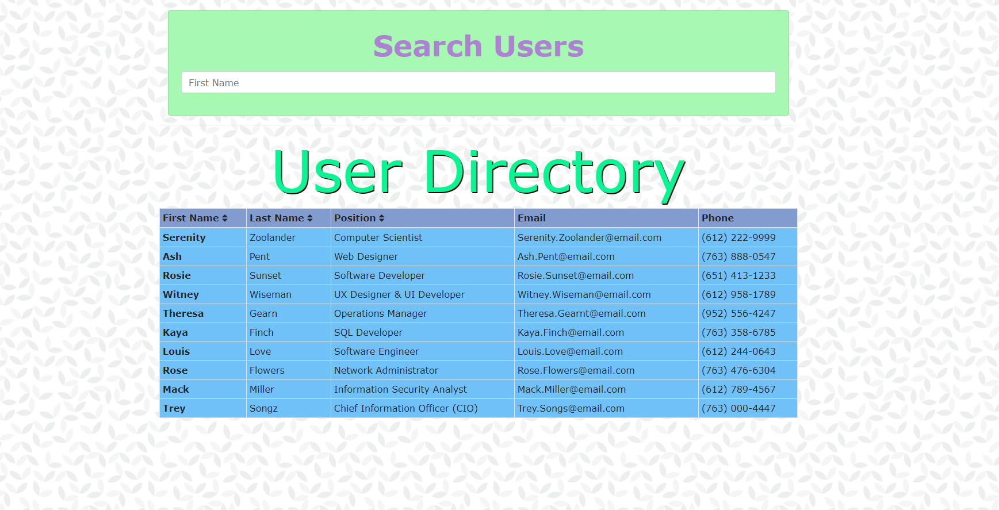

# Homework #18: User Directory

## User Story

Users are able to view their entire employee directory at once so that they have quick access to their employees information.  This is helpful for the user to not have to look through multiple folders, and drives in order to locate the correct information.  This user directory is designed to allow the user to search the directory by their first names.  The information initial page displays all of the employees and then once a name is input into the search bar, the list narrows down to the correct employee.

The information that are displayed are the following:  first name, last name, position, email, and phone number.  Users are aslo able to sort the list by each category as well by clinking on the up and down arrows next to the category names.

# Repo Details 
https://github.com/maixiong29/maixiong29.github.io/tree/master/18_user_directory

# Server Deployed
http://fair-show.surge.sh/
