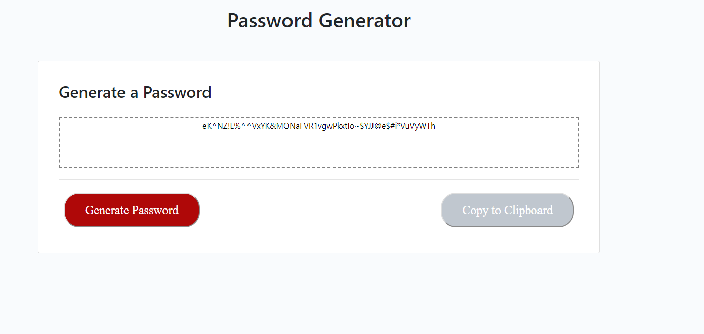

#Random Password Generator

Random password generator is used to create passwords to meet certain criterias and used to create strong passwords that provide greater security to users.

The password generator requires the user to input a number between 8-128 to generate the total number of characters the user would like generated.  It will also prompt the user to choose between the following options for the password to include:
    -Special characters
    -Numeric characters
    -Lowercase characters
    -Uppercase characters

A random password gets generated and is displayed in the text box and the user also has the option to copy the generated password to their clipboard.

Here are screenshots of what this looks like and the GitHub Pages URL:

